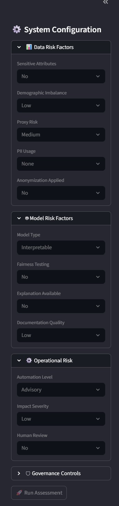
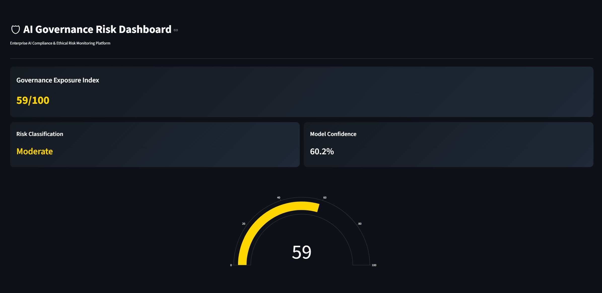
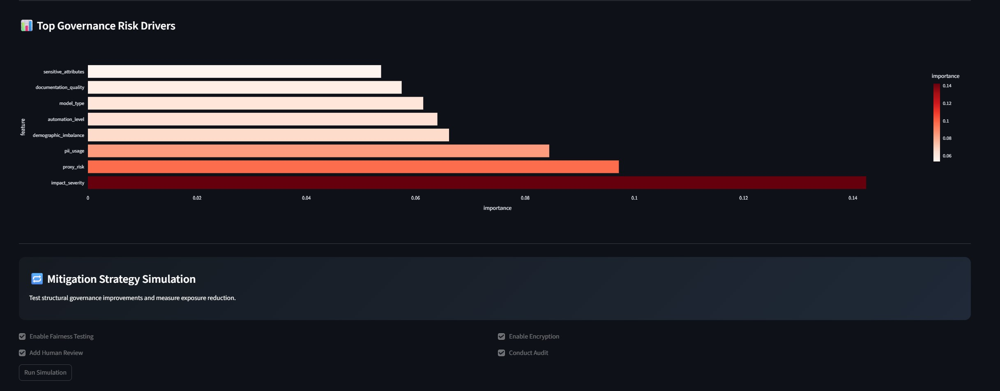
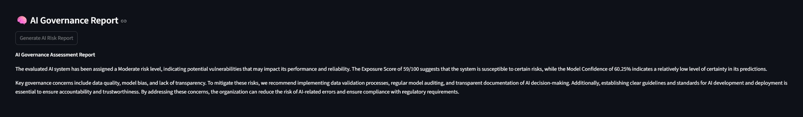

# AI Governance Risk Assessment Platform

Live Demo:  
https://ai-governance-risk-platform-sjgx9loupqvekduxtcyxs3.streamlit.app/

GitHub Repository:  
https://github.com/Parinitha15/ai-governance-risk-platform

---

##  Overview

The AI Governance Risk Assessment Platform is a modern SaaS-style decision support tool that evaluates ethical and operational risk exposure in AI-based systems.

It enables organizations to assess governance risk across data, model, operational, and compliance dimensions, generating a structured risk classification and exposure score using a supervised machine learning model.

The platform also provides mitigation simulation capabilities, allowing stakeholders to test governance improvements and measure exposure reduction dynamically.

---

## Key Features

- ✅ Multi-factor Governance Risk Evaluation (18 structured parameters)
- ✅ ML-powered Risk Classification (Low / Moderate / High / Critical)
- ✅ Governance Exposure Index (0–100 weighted scoring)
- ✅ Model Confidence Score
- ✅ Feature Importance Visualization (Explainability layer)
- ✅ Interactive Mitigation Simulation (Before vs After comparison)
- ✅ Modern Dark SaaS Dashboard UI
- ✅ Deployed on Streamlit Cloud

---

##  How It Works

1. The user configures system attributes across:
   - Data Risk Factors
   - Model Risk Factors
   - Operational Risk
   - Governance Controls

2. Inputs are encoded and passed to a trained Random Forest classifier.

3. The model outputs:
   - Risk category
   - Class probabilities
   - Confidence score

4. A Governance Exposure Index is calculated using probability-weighted scoring.

5. Users can simulate mitigation strategies and instantly compare exposure before and after structural improvements.

---

##  Tech Stack

- Python
- Scikit-learn (Random Forest Classifier)
- Pandas & NumPy
- Streamlit
- Plotly
- Joblib
- AI-Generated Governance Reports (Powered by LLaMA 3.3 via Groq)

---

## Machine Learning Model

- Multi-class classification
- Class-weight balancing to handle minority risk categories
- Feature importance extraction for interpretability
- Probability-weighted exposure scoring

The model is trained on structured synthetic governance risk data to simulate enterprise AI compliance environments.

---

##  Mitigation Simulation

The platform allows simulation of governance improvements such as:

- Enabling fairness testing
- Adding human-in-the-loop oversight
- Enabling encryption
- Conducting model audits

The system recalculates exposure and visually highlights risk reduction or increase.

---

